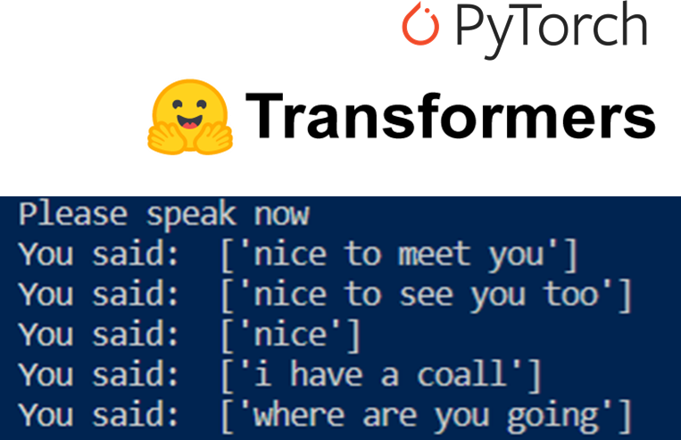

# Speech Recognition with Hugging's Face Wav2Vec2<br />
This project is about detecting user voice from microphone and converting the audio to text with Hugging Face's Transformers. The Hugging Face transformers package provide APIs to easily download and train state-of-the-art pretrained models. Wav2Vec2 is a popular pre-trained model that uses self-supervised learning for speech recognition. I used the "patrickvonplaten/wav2vec2-base-100h-with-lm" transformer model in this project, which contains the same Wav2Vec2 checkpoint but has an additional 4-gram language model for boosting Wav2Vec2 with n-grams in transformers. For recognize speech input from the microphone I used SpeechRecognition library.</br>


### To run the application locally:
```
Run: python asr.py
```

### Use this link if you have difficulties with the installation of PyAudio library:<br />
https://www.youtube.com/watch?v=IiqgHpMEaAM


